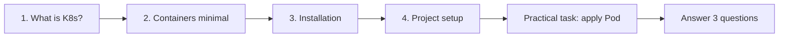

# 00 – Getting started (Phase 0)

**Phase 0 · Before you run anything**

Use this folder for notes and outcomes from Phase 0 in [ROADMAP.md](../ROADMAP.md). Follow the topic order below.

---

## Phase 0 topics (in order)

| Done | Topic | What to do |
|------|--------|------------|
| 1 | **What is Kubernetes?** | Read [what-is-kubernetes.md](what-is-kubernetes.md). Then write a short note in your words in the "In your words" section there (or in `docs/md/`). |
| 2 | **Containers (minimal)** | Read [containers-minimal.md](containers-minimal.md). Optional: run `docker run nginx:alpine` (or the suggested command there). |
| 3 | **Installation** | Follow [installation.md](installation.md): install Docker, kubectl, Kind; create cluster `learn-k8s`; run `kubectl get nodes`. |
| 4 | **Project setup** | Apply your first workload (see **Practical task** below). Tick the checklist in [CHECKLIST.md](../CHECKLIST.md). |

---

## Practical task (Phase 0)

1. Create the Kind cluster (if not done): `kind create cluster --name learn-k8s`
2. Apply one workload. Either:
   - **Minimal Pod:** from repo root:  
     `kubectl apply -f kubernetes/00-getting-started/pod-minimal.yaml`
   - **Or** use manifests from [02-hello-k8s/](../02-hello-k8s/) (Deployment + Service) when you have them.
3. Show the workload: `kubectl get pods`

You should see your Pod (e.g. `hello-phase0`) in `Running` state.

---

## Questions to answer (Phase 0)

Answer these after you've finished the topics and the practical task:

- What problem does Kubernetes solve that plain Docker doesn't?
- In one sentence, what is "desired state"?
- What are the three things you installed (Docker, kubectl, Kind) and what is each for?

*(Optional: add your answers in `docs/md/` or in a short note in this folder.)*
