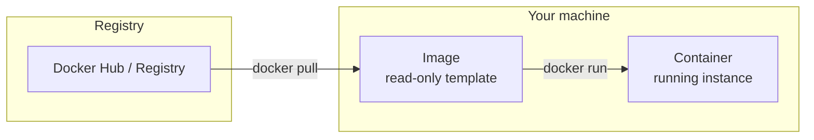
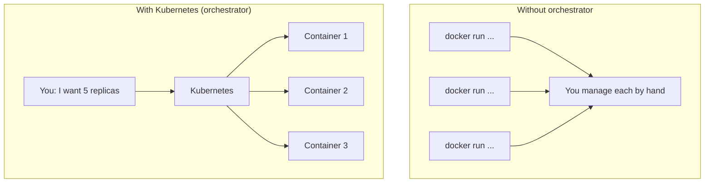

# Containers (minimal)

Phase 0 · **Containers** — Image, container, registry; why we need an orchestrator.

---

## Image, container, registry

- **Image:** A read-only template (filesystem + config) for your app. Built from a Dockerfile or pulled from a registry. Example: `nginx:alpine`.
- **Container:** A running instance of an image. It has its own process space, network, and filesystem (within the host).
- **Registry:** A store for images (Docker Hub, GitHub Container Registry, etc.). You `docker pull` from a registry and `docker run` to start a container.



---

## Try it (optional)

Run a single container with Docker:

```powershell
docker run --rm -d -p 8080:80 --name my-nginx nginx:alpine
```

- `--rm`: remove the container when it stops  
- `-d`: run in background  
- `-p 8080:80`: map host port 8080 to container port 80  
- `--name my-nginx`: name the container  

Then open http://localhost:8080 in a browser (you should see the nginx welcome page). Stop it with:

```powershell
docker stop my-nginx
```

---

## Why we need an orchestrator

One container on one machine is easy. In real systems you need many containers, often on many machines: scale up/down, restart failures, load balance, rolling updates. Doing that by hand with `docker run` doesn’t scale. Kubernetes (and similar tools) automate scheduling, scaling, healing, and networking—that’s orchestration.


