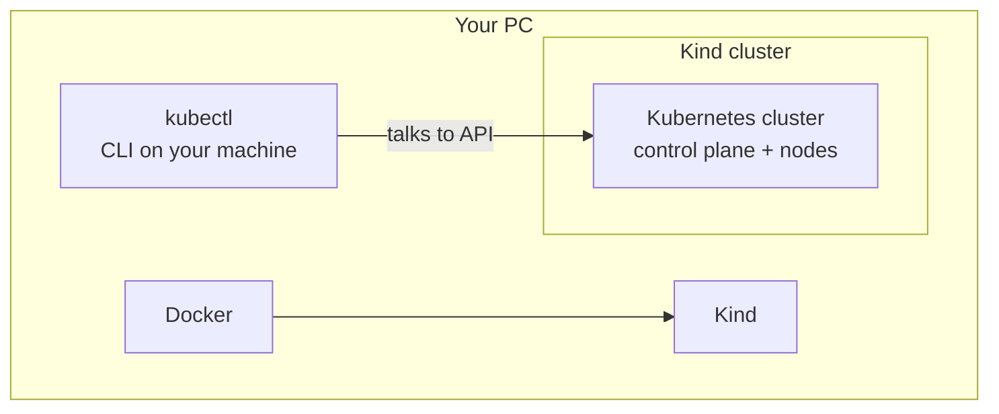
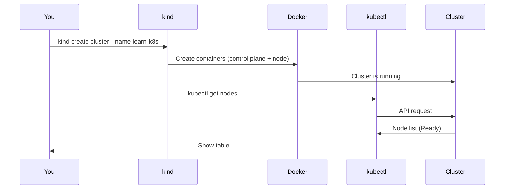

# Installation (Phase 0)

Phase 0 · **Installation** — Docker, kubectl, Kind; verify with `kubectl get nodes`.

---

## The three tools

| Tool | Purpose |
|------|--------|
| **Docker** | Build and run containers. Kind uses Docker to run the Kubernetes nodes as containers. |
| **kubectl** | Command-line client to talk to the Kubernetes API. You use it to create and manage workloads. |
| **Kind** (Kubernetes in Docker) | Runs a full Kubernetes cluster inside Docker containers on your machine. No VMs or cloud needed. |



*Docker runs Kind; Kind runs the cluster; kubectl talks to the cluster.*

---

## Install steps (Windows)

### 1. Docker

- Download **Docker Desktop** from https://www.docker.com/products/docker-desktop/
- Install and start Docker Desktop. Ensure it’s running (whale icon in system tray).
- Verify: `docker version`

### 2. kubectl

- **Option A (recommended):** Install via Chocolatey: `choco install kubernetes-cli`
- **Option B:** Download the binary from [Kubernetes release page](https://kubernetes.io/docs/tasks/tools/install-kubectl-windows/) and add it to your PATH.
- Verify: `kubectl version --client`

### 3. Kind

- With Chocolatey: `choco install kind`
- Or download from https://kind.sigs.k8s.io/docs/user/quick-start/#installation (e.g. `kind-windows-amd64.exe`, rename to `kind.exe`, put in PATH).
- Verify: `kind version`

---

## Create the cluster

From a terminal (PowerShell or cmd):

```powershell
kind create cluster --name learn-k8s
```

This creates a cluster named `learn-k8s`. Then:

```powershell
kubectl get nodes
```

You should see one node (e.g. `learn-k8s-control-plane`) in `Ready` state.



---

## If something fails

- **Docker not running:** Start Docker Desktop and wait until it’s fully up.
- **kubectl can’t connect:** Ensure you’re talking to the right cluster: `kubectl config current-context` (should mention `learn-k8s`).
- **Kind cluster already exists:** `kind get clusters` lists clusters. Delete with `kind delete cluster --name learn-k8s` then create again.

Once `kubectl get nodes` shows a Ready node, you’re done with Installation. Next: **Project setup** — apply your first workload (see [README.md](README.md)).
