# What is Kubernetes?

Phase 0 · **What is Kubernetes?** — Definition; containers vs VMs; orchestration; desired state.

> **Tip:** The flowcharts in this file are written in Mermaid. To see them as pictures (not code), use **Markdown Preview** in Cursor/VS Code (e.g. right‑click the file → “Open Preview”), or open the file on **GitHub**, or copy the code inside the fenced block into **[mermaid.live](https://mermaid.live)** and export as PNG. You don’t need to convert this to Word to understand it—each diagram has a short “in plain words” explanation right below it.

---

## Definition

**Kubernetes** (K8s) is an open-source **orchestration system** for running containerized applications. It automates deploying, scaling, and managing containers across many machines so you describe *what* you want (e.g. “run 3 copies of this app, keep them healthy, expose them on port 80”) and Kubernetes works to make the cluster match that.


**What this diagram shows (in plain words):**  
You say what you want → Kubernetes schedules containers, then scales/heals/exposes them → in the end the cluster matches what you asked for.  
*(If you see code above instead of a picture: use “Open Preview” in Cursor/VS Code, or open this file on GitHub, or paste the code into [mermaid.live](https://mermaid.live) to see the flowchart.)*

---

## What is a container?

A **container** is a runnable instance of a **container image**. The image is a package of your application plus its dependencies (libraries, config, sometimes a minimal userspace). When you *run* that image, the host’s kernel starts your app as a normal process but gives it an **isolated view** of the system: its own filesystem (from the image), its own process list, its own network (IP, ports). So the app runs in a small, repeatable environment that behaves the same on your laptop, a server, or the cloud—without installing a whole separate operating system. Tools like **Docker** and **containerd** create and run these containers by asking the Linux kernel to set up namespaces and cgroups.

**In one sentence:** A container is a process (or small group of processes) that the kernel isolates so it sees its own files, PIDs, and network, using the host’s same OS kernel.

---

## What is a VM (virtual machine)?

A **virtual machine (VM)** is a software-made “computer” that runs on top of a real machine. A program called a **hypervisor** (e.g. VMware, Hyper-V, VirtualBox) virtualizes the hardware: it gives the VM virtual CPU, virtual RAM, virtual disks, and virtual network cards. Inside the VM you install and boot a **full operating system** (Windows, Linux, etc.). That OS has its own kernel, its own drivers, and its own users. So you get a real, separate “machine” that behaves like physical hardware—strong isolation, but heavier (each VM is typically gigabytes) and slower to start (full OS boot).

**In one sentence:** A VM is a simulated computer (virtual CPU, memory, disk) that runs its own full operating system and kernel, managed by a hypervisor on the host.

---

## Containers vs virtual machines (comparison)

| | **Containers** | **Virtual machines (VMs)** |
|--|----------------|----------------------------|
| **What they share** | Share the host OS kernel | Each VM has its own full OS |
| **Size** | Small (MBs) | Large (GBs) |
| **Start time** | Seconds | Minutes |
| **Isolation** | Process/namespace isolation | Strong hardware-level isolation |

Containers package your app and its dependencies into an **image**.

**VMs: each “machine” has its own full stack (OS + kernel + app).**

```mermaid
%%{init: {'theme':'base', 'themeVariables': { 'primaryColor':'#fff3e0', 'primaryBorderColor':'#e65100', 'lineColor':'#bf360c'}}}%%
flowchart TB
  subgraph VMs["🖥️ Virtual machines"]
    direction TB
    H(("Hypervisor"))
    VM1(VM 1: OS + Kernel + App)
    VM2(VM 2: OS + Kernel + App)
    H --- VM1
    H --- VM2
  end
```



**Containers: one OS + one kernel; many apps run on top as processes.**

```mermaid
%%{init: {'theme':'base', 'themeVariables': { 'primaryColor':'#e8f5e9', 'primaryBorderColor':'#2e7d32', 'lineColor':'#1b5e20'}}}%%
flowchart TB
  subgraph Containers["📦 Containers"]
    direction TB
    Host(("Host: One OS + One Kernel"))
    A1(Container A)
    A2(Container B)
    A3(Container C)
    Host --- A1
    Host --- A2
    Host --- A3
  end
```



**How to read this:**  
- **Top diagram:** The hypervisor creates separate VMs; each VM is a full “computer” (OS + kernel + app).  
- **Bottom diagram:** The host has one OS and one kernel; each container is only your app running as a process on that shared kernel.

You run that image as a **container** (e.g. with Docker). One host can run many containers, but someone needs to decide *where* each runs, *how many*, and what to do when they fail. That’s orchestration.

---

## Containers vs VMs — in detail

### What they share (kernel vs full OS)

- **Containers:** All containers on a host use the **same Linux kernel** as the host. They don’t boot their own OS; they run as processes that see an isolated view of the system (files, network, processes) provided by the kernel. So you get many “mini environments” without extra operating systems.
- **VMs:** Each VM runs its **own full operating system** (Linux, Windows, etc.) on top of a hypervisor. The hypervisor virtualizes CPU, memory, disk, and network. So you have real OS instances, each with its own kernel and boot process.

#### “Same kernel” and “process with an isolated view” — explained simply

**What is the kernel?**  
The **kernel** is the core of the operating system. It is the one program that talks directly to the CPU, memory, and disks. It decides which process runs when, which process can see which files, and how network packets are sent. There is **exactly one kernel** running on your machine. Everything else (your apps, Docker, containers) are just **processes** that ask the kernel to do things (start a program, open a file, send data over the network).

**So when we say “containers use the host’s same kernel”:**

- There is **one** kernel on the host (e.g. your laptop or server).
- When you run a container, you are **not** starting a second OS or a second kernel. You are asking that **same** kernel to start a **new process** (your app inside the container).
- That process is like any other process (e.g. Chrome, Node, nginx), except the kernel gives it an **isolated view**: its own list of processes, its own filesystem, its own network ports, etc. So the container “thinks” it’s in its own little machine, but under the hood it’s just a normal process using the host kernel.

**“No separate OS boot”** means:  
A VM has to **boot** an entire operating system (load kernel, start services, etc.). A container does **not** boot anything. The host is already running; the kernel is already there. Starting a container = the kernel creating a new process and putting it in isolated “boxes” (namespaces). So it’s as fast as starting a normal program.

**“Process with an isolated view”** means:  
- Normally, a process can see other processes (e.g. in Task Manager or `ps`), see the host’s files, and use the host’s network.  
- For a container, the **kernel lies in a nice way**: it shows that process only *its* processes, *its* files (the container image + volumes), and *its* network. So from inside the container it *looks* like a separate machine, but it’s still one kernel serving many such “views” at the same time.

**Simple picture:**

```mermaid
%%{init: {'theme':'base', 'themeVariables': { 'primaryColor':'#e3f2fd', 'primaryBorderColor':'#1565c0'}}}%%
flowchart TB
  subgraph Host["🖥️ Host machine"]
    K(("One Linux kernel"))
    P1(Process 1: IDE)
    P2(Process 2: Docker)
    P3(Process 3: container A)
    P4(Process 4: container B)
    K --> P1
    K --> P2
    K --> P3
    K --> P4
  end
```



Containers (e.g. Process 3 and 4) are **not** separate computers. They are processes. The kernel gives each one a separate “view” so they don’t see or interfere with each other—but they all use the **same** kernel and the **same** CPU and memory (with limits).

### Size (MBs vs GBs)

- **Containers:** An image is usually tens to a few hundred MB (app + libraries + minimal userspace). No separate kernel or full OS, so they stay small.
- **VMs:** A VM includes a full OS (often 1–10+ GB per VM). You pay for duplicate kernels, system libraries, and OS tools on every VM.

### Start time (seconds vs minutes)

- **Containers:** Starting a container is like starting a process: the kernel creates namespaces and cgroups and runs the container’s main process. Typically seconds (often under one second).
- **VMs:** The hypervisor has to boot a full OS (kernel init, services, etc.). That usually takes tens of seconds to several minutes.

### Isolation: process/namespace isolation (containers)

Containers don’t get their own hardware or kernel; they get **isolation** through Linux **namespaces** and **cgroups**.

- **Namespace** = a way for the kernel to give a process (or set of processes) its own *view* of a resource, so it can’t see or affect other containers or the host in that dimension.

Common **Linux namespaces** used by containers:

| Namespace | What it isolates | Effect inside the container |
|-----------|------------------|-----------------------------|
| **PID** (Process ID) | Process tree | Container sees only its own processes (PIDs 1, 2, …). Host processes are hidden. |
| **Network** | Network interfaces, IPs, ports, routing | Container has its own IP, ports, and network stack. It can listen on port 80 without conflicting with another container’s port 80. |
| **Mount** | Filesystem mount points | Container has its own view of the filesystem (root filesystem from the image, plus any volumes). Can’t see host mounts unless explicitly given. |
| **UTS** (hostname) | Hostname and domain name | Container can have its own hostname (e.g. `my-nginx`) independent of the host. |
| **IPC** (Inter-Process Communication) | Message queues, semaphores, shared memory | Isolates IPC objects so containers don’t share them with the host or other containers. |
| **User** | User and group IDs | Container can have its own UID/GID mapping (e.g. “root” inside the container is a non-root UID on the host). |
| **Cgroup** (control groups) | Resource limits | Not a classic “namespace” but used with them: limits CPU, memory, I/O so one container can’t starve others. |

So **“process/namespace isolation”** means: the container is just a process (or a small process tree) that sees its own PIDs, network, filesystem, hostname, etc., thanks to namespaces, and its resource usage is bounded by cgroups. It still uses the host kernel; it doesn’t have a separate OS or kernel.

### Isolation: hardware-level isolation (VMs)

- **VMs** get virtualized CPU, memory, disks, and network. The guest OS runs on this virtual hardware and doesn’t share the kernel with the host. A bug or compromise in one VM doesn’t directly break the host or other VMs at the kernel level; you get stronger boundaries (at the cost of size and startup time).

---

## Summary

- **Containers** = same kernel, isolated via **namespaces** (PID, network, mount, UTS, IPC, user) and **cgroups** (CPU, memory). Small, fast, good for app workloads.
- **VMs** = full OS per VM, hardware virtualized by hypervisor. Strong isolation, larger and slower. Often used when you need a different OS or stricter isolation.

Containers are a good fit for microservices and orchestration (e.g. Kubernetes); VMs are still used for legacy apps, different OSes, and when you need that extra isolation.

---

## Orchestration

With plain Docker you might run `docker run nginx` on one machine. With many containers and many machines you need to:

- **Schedule** containers onto nodes (which container runs where).
- **Scale** (e.g. run 5 replicas).
- **Heal** (restart failed containers, replace unhealthy ones).
- **Expose** services (stable names, load balancing, networking).

Kubernetes does this: it’s the “control plane” that takes your desired state and keeps the cluster matching it.


---

## Desired state

You tell Kubernetes the **desired state** (e.g. “I want 3 Pods running image `nginx:alpine`”). The **control plane** continuously compares the actual state of the cluster to that desired state and makes changes (start/stop/restart, reschedule) until they match. So: **desired state = the target configuration you declare; Kubernetes’ job is to make the cluster match it.**


---

## In your words (fill this in after reading)

*Write a short note in your own words: what Kubernetes is and why we use it (1–3 sentences).*

```
So kubernetes is a open source orchestration system for running containrized applications like docker,etc.
We use kubernetes because it manages the whole system by restarting/stopping/reshuduling the unhealthy pods or fail pods, basically it manages all.
```

---

## Phase 0 questions (answer after this topic)

- What problem does Kubernetes solve that plain Docker doesn’t? Plain docker is just a image if it failed or became unhealthy then we need to manually restart it but kubernet can automatically restart and create new pod and fix issue.
- In one sentence, what is "desired state"? its a state where control plane try to match the actual state to the desired state that we set. for example if i set there should be 4 pods then the control plane will try to start 4 pods.
- What are the three things you will install (Docker, kubectl, Kind) and what is each for? Docker, kubectl, Kind 
Docker basically build and run containers.
Kubectl is command line client for the kubernets api and so we  use  it manage workload, check deployment status etc.
Kind run full kubernets cluster inside the docker.

*(You’ll answer these after Installation and the practical task; they’re listed in [README.md](README.md) and [ROADMAP.md](../ROADMAP.md).)*
